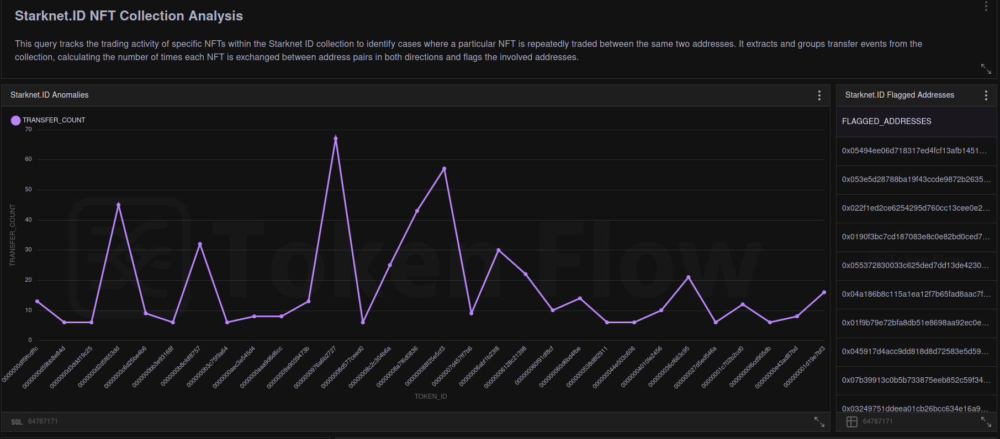
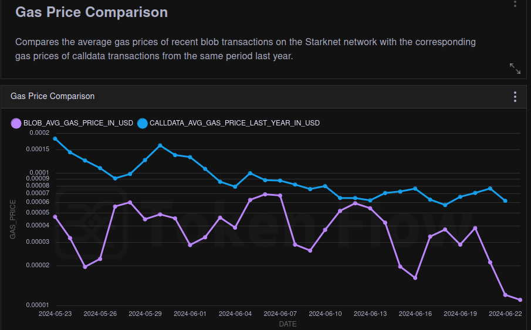
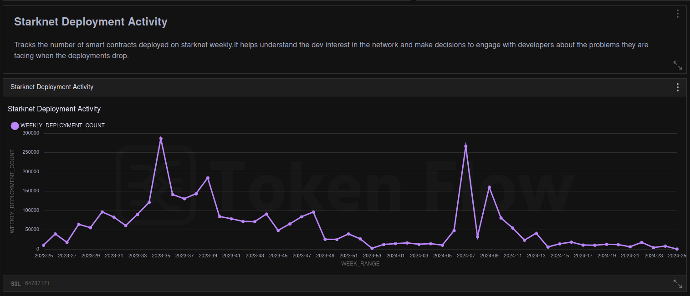
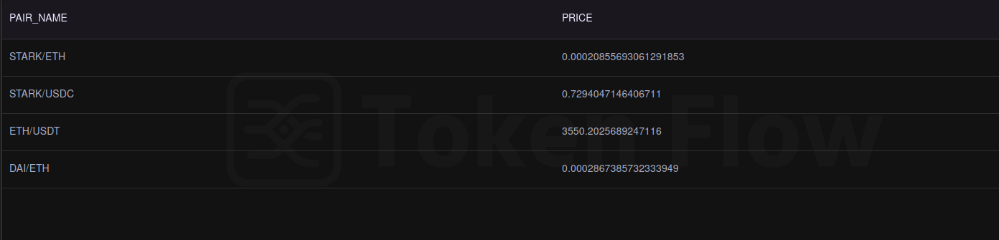
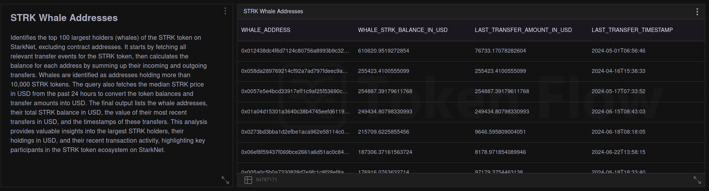
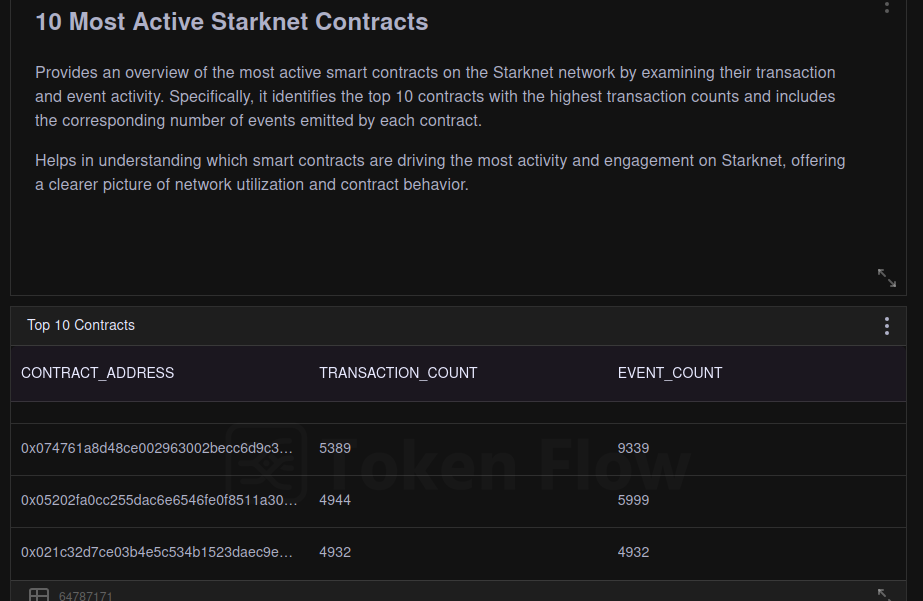

# Witness

[Witness](https://app.tokenflow.live/studio/dashboards/witness) is an analytics platform that visualizes real-time StarkNet data to help users make informed DeFi decisions and perform DYOR (Do Your Own Research). Witness tracks data from gas prices, NFTs, deployments, whale address movements, and top smart contracts.

The primary aim is to aggregate StarkNet data with interesting stats, which are not generally available.

## Features

### 1. Starknet.ID NFT Analysis
- **Objective**: Track Starknet.ID NFT with indicators to identify abnormal activities.
- **Description**: High transaction counts bilaterally between a group of addresses to inflate prices is a notorious problem with NFTs. Witness tracks these activities and flags the involved addresses as 'flagged addresses' to caution users when engaging with those NFTs. For demonstration purposes, Starknet.ID Collection is tracked here as it is one the most popular NFTs.
  
  

  [Click](https://app.tokenflow.live/studio/editor/6676602cc0743c646f127895) here to view the queries.

  [Flagged Addresses](https://app.tokenflow.live/studio/editor/6676b72c0102e4b4d830a245)

### 2. Gas Price Comparison
- **Objective**: Showcase the impact of recent changes on gas prices after the introduction of blobs.Highlights the user on how advantageous this decision is for starknet ecosystem.
- **Description**: Blobs were introduced recently in StarkNet and have played a huge role in reducing gas costs. Witness visualizes these changes using a line graph.
  
  

  [Click](https://app.tokenflow.live/studio/editor/667636f610191ab5756d8208) here to view the queries.

### 3. Deployment Activity
- **Objective**: Track the number of smart contracts deployed on StarkNet weekly.
- **Description**: This helps understand developer interest in the network. It allows stakeholders to engage with developers about the problems they face when deployments drop.
  
  

  [Click](https://app.tokenflow.live/studio/editor/667805d44267cc0f9addae82) here to view the queries.

### 4. JediSwap Token Pairs
- **Objective**: Display the prices of different token pair swaps on JediSwap
- **Description**: This feature tracks the prices of different token pair swaps by querying the different JediSwap contracts.
  
  

  [Click](https://app.tokenflow.live/studio/editor/6676992fc0743c646f127896) here to view the queries.

### 5. Whale Addresses
- **Objective**: Monitor large holders to predict market movements.
- **Description**: Witness tracks the top 100 addresses holding more than 10,000 STRK tokens. This helps communities believing in decentralization to predict large movements and their effect on price.
  
  

  [Click](https://app.tokenflow.live/studio/editor/66757ced10191ab5756d8207) here to view the queries.

### 6. 10 Most Active StarkNet Contracts
- **Objective**: Showcase the most active dApps on StarkNet.
- **Description**: This helps understand network utilization and verifies reputable contracts for new users engaging with the StarkNet ecosystem.

   

  [Click](https://app.tokenflow.live/studio/editor/66765b650102e4b4d830a242) here to view the queries.
  

## How Did We Do It?
We experimented with SQL queries on TokenFlow until we found valuable insights that would help the community. The idea was to find interesting data that usual aggregators do not track but would be helpful for users. We thoroughly enjoyed the whole process!

---
Please login to TokenFlow to view the working demo.
